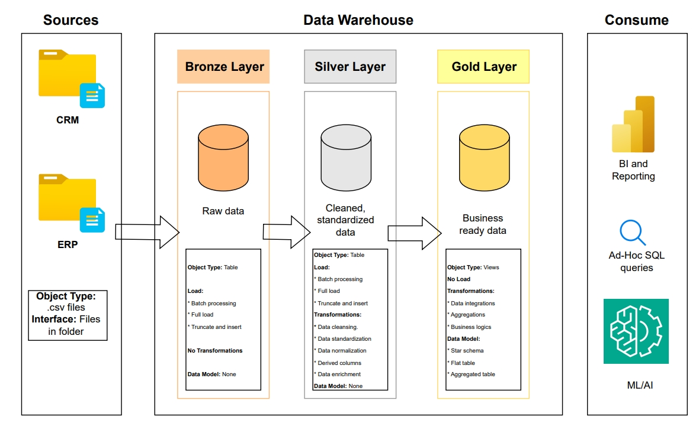
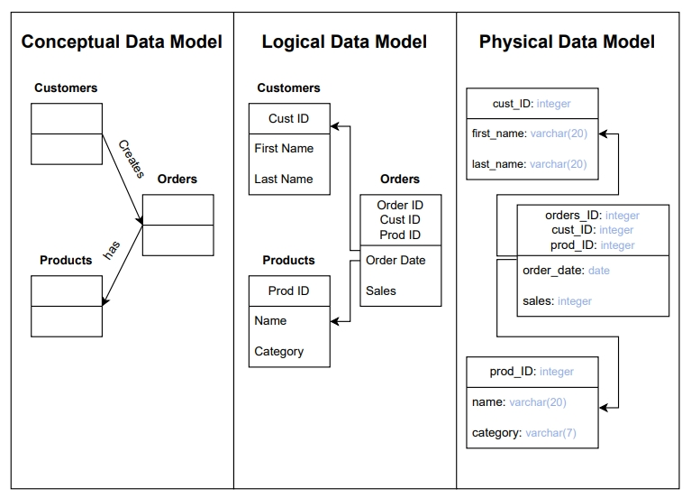

# Data Warehouse: Medallion Architecture

This repository showcases the complete journey of consuming, processing, and modeling data in **Snowflake** using the **Medallion Architecture** (Bronze, Silver, Gold).
All transformation logic is implemented through **Snowflake Stored Procedures written in JavaScript**, demonstrating how to keep processing close to the data for performance and maintainability.

## Overview

The **Medallion Architecture** organizes data into layered stages:

* **Bronze** – Raw ingested data preserved in its original form for traceability.
* **Silver** – Cleansed and standardized data, enriched with business logic.
* **Gold** – Business-ready datasets optimized for analytics and reporting.

This approach improves data quality, reusability, and scalability, while making it easy to evolve the warehouse as needs change.

## Architecture

Data flows from source ingestion into the Bronze layer, is transformed into Silver through cleansing and normalization, and finally curated into Gold models for BI and analytical workloads.

## Data Modeling

Data modeling defines how information is structured and related in the warehouse.
Three common layers of abstraction:

* **Conceptual Model** – High-level entities and their relationships.
* **Logical Model** – Entities with attributes, keys, and relationships.
* **Physical Model** – Actual tables with data types, constraints, and indexes.

## Schema Design Approaches

Two common analytical schema patterns:

* **Star Schema** – Central fact table connected to denormalized dimensions; simple and fast to query.
* **Snowflake Schema** – Normalized dimensions split into multiple tables; more storage-efficient, but requires additional joins.

## Facts vs. Dimensions

* **Dimensions** – Descriptive attributes providing context (Who? What? Where?).
* **Facts** – Quantitative measures or events (How much? How many?).

## Why This Matters

Implementing a medallion-style data warehouse in Snowflake with JavaScript stored procedures enables:

* **Performance** – Logic executes within Snowflake’s compute layer.
* **Maintainability** – Modular, layered transformations make it easy to adapt.
* **Data Quality** – Each layer enforces standards before data moves forward.
* **Scalability** – Architecture supports new sources and downstream use cases.

## Getting Started

1. Review the architecture diagrams and modeling concepts in this repo.
2. Explore the stored procedure scripts to understand the transformation logic.
3. Adapt the patterns to your own Snowflake environment and datasets.
