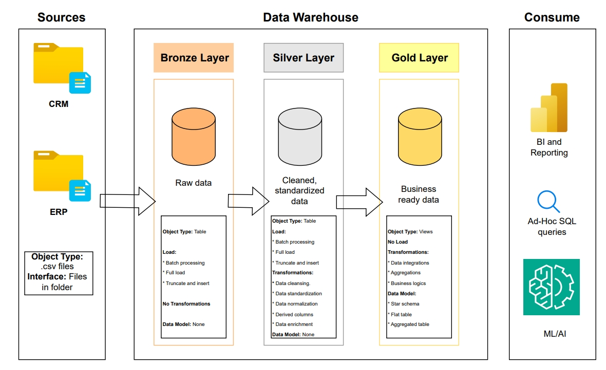

## **Data Warehouse: Medallion Architecture**

### **Data Architecture**

### **Data Modeling**

Data modeling is the provess of defiing and visualizing the structure of the data, including the relationships between tables, to ensure the data is organized, consistent, and easily understood by both developers and analysts.

In data modeling there are three different ways on how to draw a data model:

* **Conceptual data model:** It serves the purpose to focus only on the entity and the relationships between them. We do not specify any columns or attributes.

* **Logical data model:** This model serves the purpose of identifying the columns in each entity. We specify the relationships between the tables and the primary keys in each table.

* **Physical data model:** This is similar to the logical data model, but in this model we specify the data types, and the column names.

### **Star Schema vs Snowflake Schema**

The two most common data models are star schemas, and snowflake schemas. Both of these models are optimized for analytics, fixable, scalable, and easy to understand. Each of these has specific characteristics that differntiate them from the other:

* **Star Schema:** It consists of a single fact table surrounded by dimension tables. The Star Schema is simple and easy to understand. However, it may contain big dimensions with duplicates. Dimensions usually get bigger with time.

* **Snowflake Schema:** It is similar to the Star Schema, but this schema has the dimension tables split up into smaller tables. The Snowflake Schema is a little more complex, and requires more knowlegde and effort to query it, given the amount of tables to join. However, given the normalized tables, you get to optimze the storage.

### **Facts vs Dimensions**

* **Dimensions:** Contain descriptive information that give context to the date.
    * For example: Product name, category, subcategory,
    * Answers: Who? What? Where?

* **Facts:** Contain quantitive information that represents events.
    * For example: IDs, dates, numbers.
    * Answers: How much? How many?